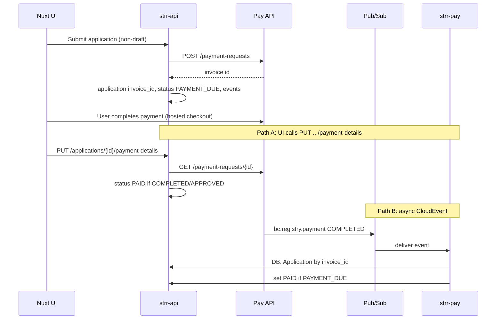

# Runbook: Payments

After checkout, an application reaches `PAID` via synchronous `PUT .../payment-details` and/or async handling in `strr-pay` (Pay CloudEvents). This runbook also covers BC Registries Pay API usage, `strr-db` queries, and **manual** cross-reference with **fin_warehouse** (external to this repo).

**Primary code:** `strr-api/src/strr_api/services/payment_service.py`, `strr-api/src/strr_api/resources/application.py`, `queue_services/strr-pay/src/strr_pay/resources/pay_listener.py`.

## End-to-end flow



## Two paths to PAID

1. **Synchronous refresh:** Client calls `PUT /applications/<application_number>/payment-details`. The API fetches the latest invoice from Pay API and runs `ApplicationService.update_application_payment_details_and_status`.
2. **Async:** `strr-pay` worker consumes CloudEvents (`ce.type == bc.registry.payment`, `status_code == COMPLETED`), finds `Application` by `invoice_id`, and if status is `PAYMENT_DUE`, sets `PAID` and `payment_completion_date`.

**Worker retry:** If no application row exists yet, worker may return **404** so Pub/Sub can retry (see `pay_listener.py`).

## Pay API usage (API side)

| Action          | HTTP                                                                                                                                                   |
| --------------- | ------------------------------------------------------------------------------------------------------------------------------------------------------ |
| Create invoice  | `POST {PAYMENT_SVC_URL}/payment-requests` with `Authorization` (user JWT), `Account-Id`, body includes `businessInfo.corpType: "STRR"` and filing info |
| Refresh invoice | `GET {PAYMENT_SVC_URL}/payment-requests/{invoice_id}`                                                                                                  |
| Receipt PDF     | `POST {PAYMENT_SVC_URL}/payment-requests/{invoice_id}/receipts` with `Accept: application/pdf`                                                         |

**Config:** `PAYMENT_SVC_URL` = `PAY_API_URL` + `PAY_API_VERSION` in `strr-api/src/strr_api/config.py`.

## STRR database (payment fields)

Table `**application`** (see `strr-api/src/strr_api/models/application.py`):

| Column                    | Meaning                                                                                         |
| ------------------------- | ----------------------------------------------------------------------------------------------- |
| `invoice_id`              | Pay API payment-request id                                                                      |
| `payment_status_code`     | String (aligns with pay statuses such as CREATED, COMPLETED; see `PaymentStatus` enum in code) |
| `payment_completion_date` | When payment completed                                                                          |
| `payment_account`         | Account id context (string)                                                                     |

**Events:** `INVOICE_GENERATED`, `PAYMENT_COMPLETE`, `APPLICATION_SUBMITTED` in `events` table (`event_name`).

**Note:** There is no separate `invoices` table; reconciliation keys off `**invoice_id`** on `application`.

## Payment states (reference)

Enum `PaymentStatus` in `strr-api/src/strr_api/enums/enum.py` includes e.g. `CREATED`, `COMPLETED`, `PAID`, `APPROVED`, `FAILED`, `REFUNDED`. **Refunds** are not implemented as an automated workflow in STRR. Treat `REFUNDED` as operational/manual via Pay API.

## Receipts

- Route: `GET /applications/<application_number>/payment/receipt` (PDF from Pay API).
- Blocked if application status is in unpaid states (`APPLICATION_UNPAID_STATES`, including `DRAFT`, `PAYMENT_DUE`).

## GCP Cloud Logging queries

**Note:** Queries below are pinned to **prod** service names (`*-prod`). For other environments, replace `-prod` with the appropriate suffix (for example `-test` or `-dev`).

**Invoice creation failures (strr-api):**

```text
resource.type="cloud_run_revision"
resource.labels.service_name="strr-api-prod"
textPayload=~"(Pay-api integration|Invalid response from pay-api|create invoice)"
```

**Payment completion (strr-pay):**

```text
resource.type="cloud_run_revision"
resource.labels.service_name="strr-pay-prod"
jsonPayload.message=~"Processing payment"
```

**strr-pay 404 (retries):**

```text
resource.type="cloud_run_revision"
resource.labels.service_name="strr-pay-prod"
httpRequest.status=404
```

**strr-pay errors:**

```
resource.type="cloud_run_revision"
resource.labels.service_name="strr-pay-prod"
severity="ERROR"
```

**Receipt failures:**

```text
resource.type="cloud_run_revision"
resource.labels.service_name="strr-api-prod"
textPayload=~"Failed to get receipt pdf for filing"
```

**Trace by invoice id (API + worker):**

```text
resource.type="cloud_run_revision"
(resource.labels.service_name="strr-api-prod" OR resource.labels.service_name="strr-pay-prod")
textPayload=~"<INVOICE_ID>" OR jsonPayload.message=~"<INVOICE_ID>"
```

## SQL: STRR (strr-db)

**Full payment state:**

```sql
SELECT a.application_number, a.type, a.registration_type, a.status,
       a.invoice_id, a.payment_status_code, a.payment_completion_date,
       a.payment_account, a.application_date, a.decision_date
FROM application a
WHERE a.application_number = '<APP_NUMBER>';
```

**By invoice_id (to cross-reference with fin_warehouse):**

```sql
SELECT a.application_number, a.type, a.registration_type, a.status,
       a.invoice_id, a.payment_status_code, a.payment_completion_date,
       a.payment_account, a.application_date
FROM application a
WHERE a.invoice_id = <INVOICE_ID>;
```

**Payment event timeline:**

```sql
SELECT e.event_name, e.details, e.created_date, u.username
FROM events e
LEFT JOIN users u ON e.user_id = u.id
WHERE e.application_id = (SELECT id FROM application WHERE application_number = '<APP_NUMBER>')
  AND e.event_name IN ('INVOICE_GENERATED', 'PAYMENT_COMPLETE', 'APPLICATION_SUBMITTED')
ORDER BY e.created_date;
```

**PAYMENT_DUE with invoice set:**

```sql
SELECT application_number, invoice_id, payment_status_code,
       payment_account, application_date, modified
FROM application
WHERE status = 'PAYMENT_DUE'
  AND invoice_id IS NOT NULL
ORDER BY application_date DESC;
```

**PAID but no registration (possible downstream failure):**

```sql
SELECT a.application_number, a.invoice_id, a.payment_status_code,
       a.payment_completion_date, a.status, a.registration_id
FROM application a
WHERE a.status = 'PAID'
  AND a.registration_id IS NULL
  AND a.payment_completion_date < NOW() - INTERVAL '2 hours'
ORDER BY a.payment_completion_date;
```

**Summary counts:**

```sql
SELECT payment_status_code, status, COUNT(*) AS cnt
FROM application
WHERE payment_status_code IS NOT NULL
GROUP BY payment_status_code, status
ORDER BY cnt DESC;
```

**By SBC account:**

```sql
SELECT application_number, type, status, invoice_id,
       payment_status_code, payment_completion_date, application_date
FROM application
WHERE payment_account = '<SBC_ACCOUNT_ID>'
ORDER BY application_date DESC;
```

**Cross-reference row for fin_warehouse / Pay API:**

```sql
SELECT a.application_number, a.invoice_id, a.payment_status_code,
       a.payment_completion_date, a.payment_account,
       a.status AS app_status, a.type AS app_type,
       r.registration_number, r.status AS reg_status
FROM application a
LEFT JOIN registrations r ON a.registration_id = r.id
WHERE a.invoice_id = <INVOICE_ID>;
```

**To match all invoices in strr with invoices in pay**:

```sql
SELECT a.application_number, a.invoice_id, i.id, a.payment_status_code,
       a.payment_completion_date, a.payment_account
FROM strr.application a
LEFT JOIN strr.registrations r ON a.registration_id = r.id
left join pay.invoices i on i.id = a.invoice_id;
```

**Recent payments to audit (last 7 days):**

```sql
SELECT a.application_number, a.invoice_id, a.payment_status_code,
       a.payment_completion_date, a.payment_account, a.status
FROM application a
WHERE a.payment_status_code IS NOT NULL
  AND a.payment_completion_date >= NOW() - INTERVAL '7 days'
ORDER BY a.payment_completion_date DESC;
```

## fin_warehouse (external database)

`fin_warehouse` DB is found in `Data Warehouse 'Prod' (mvnjri-prod) project`. Use it for financial reconciliation, audits, and cross-checking Pay API settlement data.

### Reconciliation scenarios

| Scenario                          | STRR                                              | fin_warehouse       | Action                                                                                                                                                                                    |
| --------------------------------- | ------------------------------------------------- | ------------------- | ----------------------------------------------------------------------------------------------------------------------------------------------------------------------------------------- |
| Paid in finance but stuck in STRR | `status=PAYMENT_DUE`, `invoice_id` set            | Completed / settled | Worker may have missed event. Confirm Pay API `GET /payment-requests/{id}`. If paid, coordinate **manual** DB update with governance; then ensure auto-approval/job expectations are met. |
| Duplicate invoices                | Same `application_number`, different `invoice_id` | Multiple rows       | Identify paid invoice in Pay API; void or adjust others per Pay API process                                                                                                               |
| Refund                            | `payment_status_code` still COMPLETED             | `refund_amount > 0` | No automated refund in STRR; Pay API admin; update STRR payment fields if policy requires                                                                                                 |
| Missing in warehouse              | `invoice_id` in STRR                              | No row              | Payment may not have completed; verify Pay API first                                                                                                                                      |
